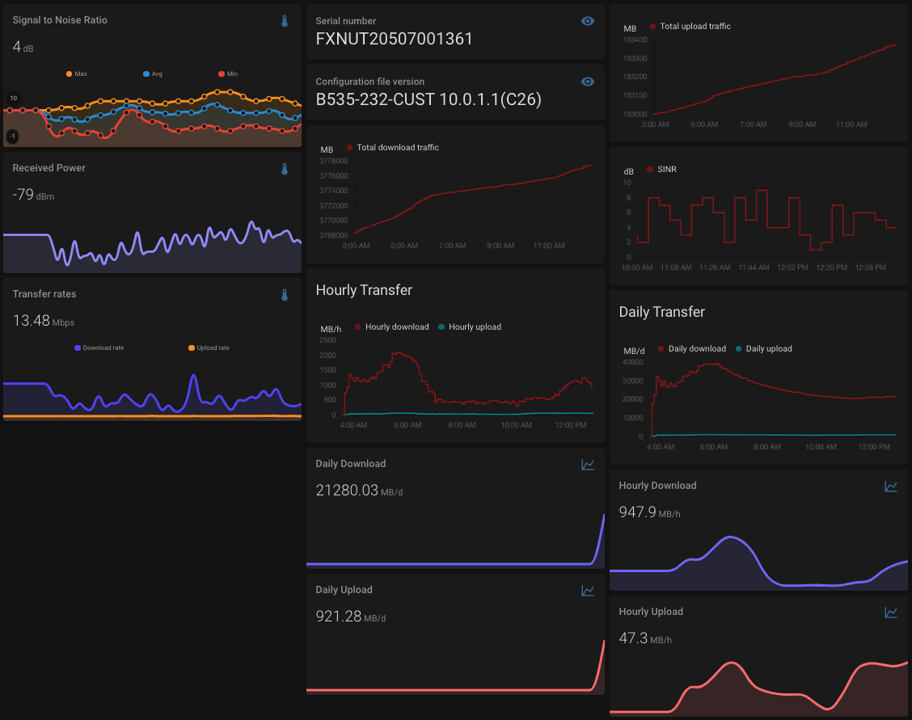

# HUAWEI Metrics Exporter

A single binary which scrapes the HUAWEI router web interface for all device information. Can be used as metrics for connection strenth and speed as well as data usage. It includes information which are hidden on the web interface.



It currently outputs JSON and OpenMetrics which can be piped into a file and then uploaded to a service like homeassistant and prometheus or archived and analyzed manually.

```json
{
  "INI": {
    "label_id": "deviceinformation.INI",
    "label": "Configuration file version",
    "value_id": "di-iniversion",
    "value": "B535-232-CUST 10.0.1.1(C26)",
    "parsed": null,
    "hidden": false
  },
  "sinr": {
    "label_id": "deviceinformation.sinr",
    "label": "SINR",
    "value_id": "di-sinr",
    "value": "-1dB",
    "parsed": {
      "value": -1,
      "unit": "dB"
    },
    "hidden": false
  },
  "currentdownloadrate": {
    "label_id": "deviceinformation.currentdownloadrate",
    "label": "Download rate",
    "value_id": "deviceinformation_currentdownloadrate",
    "value": "4.41Kbps",
    "parsed": {
      "value": 0.004306640625,
      "unit": "Mbps"
    },
    "hidden": true
  },
  "totaldownload": {
    "label_id": "deviceinformation.totaldownload",
    "label": "Total download traffic",
    "value_id": "deviceinformation_totaldownload",
    "value": "3767677.91MB",
    "parsed": {
      "value": 3767677.91,
      "unit": "MB"
    },
    "hidden": true
  },
  "rsrp": {
    "label_id": "deviceinformation.rsrp",
    "label": "RSRP",
    "value_id": "di-rsrp",
    "value": "-109dBm",
    "parsed": {
      "value": -109,
      "unit": "dBm"
    },
    "hidden": false
  }
  // ...
}
```

Currently only numeric device information with a known unit are included in the prometheus output format `huawei-metrics -f prometheus`:

```
# HELP huawei_metrics_currentdownloadrate_mbps Download rate
# TYPE huawei_metrics_currentdownloadrate_mbps gauge
huawei_metrics_currentdownloadrate_mbps 0.028642578125
# HELP huawei_metrics_currentuploadrate_mbps Upload rate
# TYPE huawei_metrics_currentuploadrate_mbps gauge
huawei_metrics_currentuploadrate_mbps 0.007880859375
# HELP huawei_metrics_rsrp_dbm RSRP
# TYPE huawei_metrics_rsrp_dbm gauge
huawei_metrics_rsrp_dbm -110
# HELP huawei_metrics_rsrq_db RSRQ
# TYPE huawei_metrics_rsrq_db gauge
huawei_metrics_rsrq_db -10
# HELP huawei_metrics_rssi_dbm RSSI
# TYPE huawei_metrics_rssi_dbm gauge
huawei_metrics_rssi_dbm -81
# HELP huawei_metrics_sinr_db SINR
# TYPE huawei_metrics_sinr_db gauge
huawei_metrics_sinr_db 2
# HELP huawei_metrics_totaldownload_mb Total download traffic
# TYPE huawei_metrics_totaldownload_mb counter
huawei_metrics_totaldownload_mb 3777746.68
# HELP huawei_metrics_totalupload_mb Total upload traffic
# TYPE huawei_metrics_totalupload_mb counter
huawei_metrics_totalupload_mb 183395.66
```

## Installation

`cargo install --git https://github.com/mtib/huawei-metrics-exporter`

## Environemnt Variables

This exporter uses the following environemt variables:

- `CHROME_BINARY`: Absolute path to chrome(ium) binary to use.
- `CHROMEDRIVER_PORT`: Port at which [chromedriver][chromedriver] is running locally.
- `HUAWEI_ROUTER_HOST`: IP or hostname at which HUAWEI router web interface can be found.
- `HUAWEI_ROUTER_PASS`: Password for login on HUAWEI router web interface.

### Dotfile

At `.env` in PWD.

## Example usage

### Uploading to HASS webhook trigger

```sh
#!/bin/bash

ENDPOINT=some_enpoint_id
TMPFILE=".huawei.json"
CHROMEDRIVER_PORT=9515 HUAWEI_ROUTER_PASS=your-very-secure-password huawei-metrics > $TMPFILE
data=$(cat $TMPFILE)
curl -X POST -H "Content-Type: application/json" --data "$data" https://hass.local/api/webhook/$ENDPOINT
```

```yaml
template:
  - trigger:
    - platform: webhook
      webhook_id: "some_endpoint_id"
    sensor:
      - name: '{{ trigger.json.sinr.label }}'
        state: '{{ trigger.json.sinr.parsed.value }}'
        unit_of_measurement: 'dB'
        unique_id: sinr
      - name: '{{ trigger.json.serialNumber.label }}'
        state: '{{ trigger.json.serialNumber.value }}'
        unique_id: serial
      - name: '{{ trigger.json.INI.label }}'
        state: '{{ trigger.json.INI.value }}'
        unique_id: ini
```

### Pushing to Prometheus Pushgateway

```sh
#!/bin/bash

source $HOME/.cargo/env

TMPFILE=".huawei.metrics"
CHROMEDRIVER_PORT=9515 HUAWEI_ROUTER_PASS=your-very-secret-password huawei-metrics -f prometheus > $TMPFILE
curl -X POST -H  "Content-Type: text/plain" --data-binary "@$TMPFILE" https://pushgateway.example.com/metrics/job/huawei_metrics/instance/some_instance_id
```

## Troubleshooting

`pretty_env_logger` is included and can be enabled with `RUST_FMT="huawei_metrics=trace" huawei-metrics`.

[chromedriver]: https://chromedriver.chromium.org/